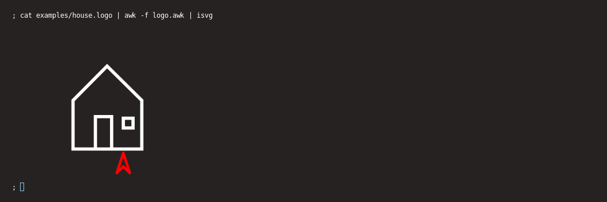

A simple logo implementation, written in awk.
Output is to SVG.

Run it like this:

    ; cat x.logo | awk -f logo.awk

The house that twitter drew: 
https://twitter.com/thingskatedid/status/1454223213727076356
